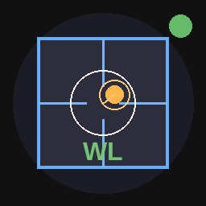

# Daily WL QA

**Daily Winston-Lutz isocenter walk QA for Elekta Versa HD LINACs**
using the Standard Imaging MIMI Phantom (6.4 mm air void).



---

## What it does

Loads four Elekta iViewGT portal DICOM images (G0 / G90 / G180 / G270),
automatically detects the MIMI phantom air void in each image, computes the
**radiation/mechanical walk circle** via the Minimum Enclosing Circle (MEC)
algorithm, and generates a signed PDF QA report — in seconds.

| Feature | Detail |
|---------|--------|
| **Input** | Elekta iViewGT RTIMAGE DICOM files (4 cardinal angles) |
| **Phantom** | Standard Imaging MIMI — 6.4 mm air void |
| **Algorithm** | MEC of all 4 raw displacement vectors |
| **Pass/Fail** | Walk circle radius ≤ 1.0 mm |
| **Output** | PDF report + SQLite trend database |
| **Platforms** | Linux · Windows · macOS |

---

## Installation

### Windows (hospital / restricted PC) — no admin rights needed

> No system Python required. The setup script downloads its own
> self-contained Python runtime into the app folder.

**Step 1** — Download the app

Click **Code → Download ZIP** on GitHub, unzip anywhere (e.g. your Desktop or `Documents`).

**Step 2** — Run setup (one time only)

Double-click **`setup_windows.bat`**

This will:
- Download Python 3.12 embeddable (~8 MB) into a `python_runtime` folder inside the app
- Install all dependencies (PySide6, pydicom, scipy, reportlab, matplotlib, Pillow, OpenCV)
- Generate the app icon

**Step 3** — Launch the app

Double-click **`run_wl_qa.bat`**

That's it. No Python installation, no admin rights, no IT involvement.

> **Already have rad-inventory installed?**  The setup is identical — it uses the same
> self-contained embedded Python approach.  You can run `setup_windows.bat` from the
> WL QA folder independently; it will not affect rad-inventory.

---

### Linux / macOS

```bash
git clone https://github.com/hwsalmon/daily-wl-qa.git
cd daily-wl-qa
python3 install.py
```

The installer handles dependencies, icon generation, and adds *Daily WL QA* to
your application menu automatically.

---

## Manual install (fallback)

```bash
pip install -r requirements.txt
python3 wl_qa_tool.py          # Linux / macOS
python  wl_qa_tool.py          # Windows (if Python is on your PATH)
```

---

## System requirements

| Requirement | Minimum |
|-------------|---------|
| Python | 3.10 or newer |
| RAM | 512 MB |
| Disk | 400 MB (including dependencies) |
| Display | 1280 × 800 or larger |
| OS | Linux (X11 or Xwayland), Windows 10/11, macOS 12+ |

### Python packages installed automatically

| Package | Purpose |
|---------|---------|
| `PySide6` | Qt-based GUI framework |
| `pydicom` | DICOM file reading |
| `opencv-python` | Image processing |
| `scipy` | Gaussian filter, blob analysis |
| `reportlab` | PDF generation |
| `matplotlib` | Diagnostic figure rendering |
| `Pillow` | Image scaling |

---

## Usage

### 1. Select machine and physicist
Use the dropdowns at the top of the window before loading data.

### 2. Load DICOM directory
Click **Load DICOM Directory** and select the folder containing the four
Elekta iViewGT portal DICOM files from that day's WL acquisition.
The folder should contain one file per cardinal gantry angle
(G0, G90, G180, G270 — within ±5° of each cardinal).

### 3. Review results
- **PASS/FAIL banner** — walk circle radius vs. 1.0 mm tolerance, shown immediately.
- **Results tab** — raw displacements (Field → Void) and corrected displacements
  (3D setup error removed) for all four angles, colour-coded green/amber/red.
  The corrected-table subtitle shows the live **3D CBCT setup error**
  (Lateral / SI / AP mm) derived from all four images.
- **Portal Images tab** — 5-panel diagnostic figure: one portal image per angle
  (field boundary overlay, crosshair, void marker, displacement arrow, scale bar)
  plus a 2-D displacement map showing the walk circle.

### 4. Generate report
Click **Generate Daily Report (PDF)**.  
The report includes:
- Metadata (machine, physicist, date from DICOM header, phantom, tolerance,
  **3D CBCT setup error** — Lateral / SI / AP mm)
- Colour PASS/FAIL banner
- Raw displacement table (ΔX axis labelled Lateral or AP per gantry angle)
- Corrected displacement table (3D setup error removed; Lat walk / AP walk labelled)
- Portal diagnostic figure
- Methodology notes
- **Electronic signature block** (physicist name, timestamp, 21 CFR Part 11 statement)

Each report generation automatically saves a record to `wl_qa_history.db`.

### 5. View trend analysis
Click **View Trends** at any time to see a per-machine time-series plot of
walk circle radius with tolerance and advisory lines, plus a scrollable table
of all historical records.

---

## Machine and physicist configuration

Machines and physicists are defined as lists near the top of `wl_qa_tool.py`
(lines ~115–126):

```python
MACHINES = [
    "Elekta VersaHD 153991",
    "Elekta VersaHD 156724",
    "Elekta VersaHD 154613",
]

PHYSICISTS = [
    "Howard W. Salmon, PhD, DABR",
    "Shawn Hollars, MS, DABR",
    "Logen Hall, MS, DABR",
]
```

To add or change machines or physicists, edit those two lists and save —
no other changes are needed.

---

## DICOM requirements

- Elekta iViewGT RTIMAGE files (modality `RTIMAGE`)
- Files **do not** need a DICOM File Meta Information header (the Elekta
  iViewGT format omits the Transfer Syntax UID — handled automatically)
- One file per gantry angle; the `GantryAngle` DICOM tag is used to assign
  each file to its nearest cardinal angle
- Pixel spacing and SID/SAD are read from the DICOM header for automatic
  magnification correction

---

## Clinical notes

### Portal coordinate system

Elekta iViewGT stores portal images with a **consistent patient orientation** at
all gantry angles (no image flip at opposing gantry positions).

| Gantry | Portal X | Portal Y |
|--------|----------|----------|
| G0° / G180° | Patient **Lateral** (L/R) | Patient **SI** (S/I) |
| G90° / G270° | Patient **AP** (A/P) | Patient **SI** (S/I) |

The 3D CBCT residual setup error is therefore:

```
Lateral = (ΔX_G0  + ΔX_G180) / 2
SI      = mean(ΔY_G0, ΔY_G90, ΔY_G180, ΔY_G270)
AP      = (ΔX_G90 + ΔX_G270) / 2
```

Subtracting the angle-appropriate component from each raw displacement yields
pure mechanical walk residuals. The **Minimum Enclosing Circle** radius of those
four residual vectors is the walk circle metric.

### Pass/Fail criterion

Walk circle radius ≤ **1.0 mm** (editable via `TOLERANCE_MM` in `wl_qa_tool.py`).

### Void detection

The MIMI air void receives *more* dose than the surrounding acetal phantom
(air attenuates less at MV energies). Elekta iViewGT stores pixels inverted
(LOW value = HIGH dose), so the void is the **local minimum** within the
irradiated field. Detection pipeline:

1. Gaussian pre-filter (σ ≈ void_radius × 0.30 px) — suppresses MV noise
2. Global minimum pixel within the central 50% of the field
3. Inverse-intensity-squared centroid — sub-pixel void localisation

---

## File layout

```
wl_qa_tool.py       Main application (single file — no build step)
install.py          One-step installer
run_wl_qa.bat       Windows double-click launcher
requirements.txt    Python dependency list
icon.png            App icon (256 px)
icon_512.png        App icon (512 px master)
icon.ico            Windows multi-resolution icon (16–256 px)
CLAUDE.md           Developer / AI assistant reference
wl_qa_history.db    SQLite trend database (auto-created, not in git)
```

---

## Trend database

`wl_qa_history.db` is created automatically in the same folder as
`wl_qa_tool.py` on first run.  It is a standard SQLite file and can be
opened with any SQLite browser (e.g. [DB Browser for SQLite](https://sqlitebrowser.org/)).

The database is excluded from git (`.gitignore`) because it contains
site-specific QA records.

---

## License

For clinical and research use at Franciscan Health Indianapolis.  
Contact: Howard W. Salmon, PhD, DABR — howard.w.salmon@gmail.com
